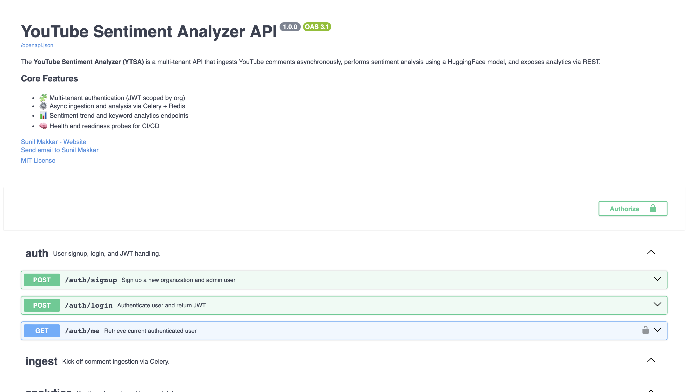
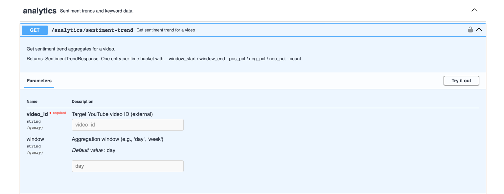
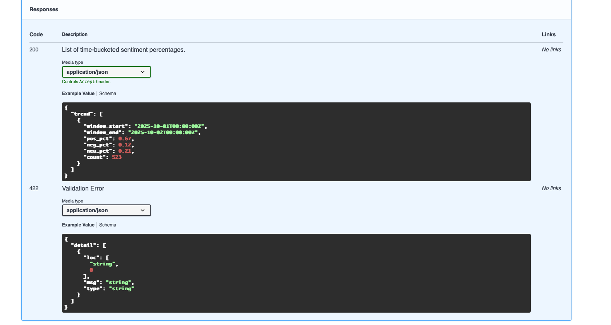
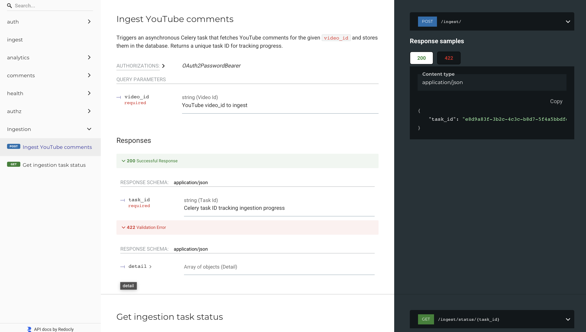

# YouTube Sentiment Analyzer (YTSA) API

[](#)  
[](LICENSE)  
[](https://www.python.org/)  
[](https://fastapi.tiangolo.com/)
[](https://docs.docker.com/compose/)


The YouTube Sentiment Analyzer (YTSA) is a multi-tenant API that ingests YouTube comments asynchronously, performs sentiment analysis using a HuggingFace model, and exposes analytics via REST.

---

## Overview

YTSA is designed for developers and data engineers looking to integrate YouTube comment sentiment analysis into their applications or analytics pipelines.  

The system provides:  

- Multi-tenant authentication scoped by organization (`org_id` via JWT)  
- Async ingestion and processing using Celery + Redis  
- Sentiment analysis via HuggingFace transformer models  
- REST endpoints for trends, distributions, and keyword frequencies  
- Health and readiness probes for orchestration and CI/CD pipelines  

---

## Why I Built This

I built YTSA to deepen my backend development skills and gain hands-on experience with modern frameworks and tools. Specifically, I wanted to learn FastAPI, explore asynchronous processing pipelines using Celery and Redis, and build a production-style API with multi-tenant authentication, PostgreSQL, and comprehensive testing. This project reflects my focus on designing scalable, well-structured backend systems that mirror real-world engineering environments.

### Data Flow

When a video is ingested, the API enqueues a Celery task that fetches comments from the YouTube API, applies HuggingFace sentiment models asynchronously, and persists the results in PostgreSQL. Redis acts as both the broker and cache layer, enabling scalable parallel processing.

---

## Features

- ✅ Multi-tenant auth with JWT  
- ✅ Async ingestion pipeline for YouTube comments  
- ✅ Sentiment trend and distribution endpoints  
- ✅ Top keyword extraction for videos  
- ✅ Health (`/health/healthz`) and readiness (`/health/readyz`) endpoints  

---

## Architecture
```
                  +----------------+
                  |   FastAPI API  |
                  +--------+-------+
                           |
                           v
                   +---------------+
                   |   Celery      |
                   |  (async tasks)|
                   +-------+-------+
                           |
          +----------------+----------------+
          |                                 |
          v                                 v
    +------------+                     +---------+
    |  Redis     |                     | PostgreSQL |
    |  (Broker   |                     | (Storage)  |
    |   & Cache) |                     +------------+
    +------------+
                           |
                           v
                 +--------------------+
                 | HuggingFace Model  |
                 | (Sentiment Analysis)|
                 +--------------------+
```

---

**Tech Stack:**

- FastAPI — REST API framework  
- SQLAlchemy 2.x + PostgreSQL — relational data storage  
- Redis — caching and Celery broker  
- Celery — async task processing  
- HuggingFace Transformers — sentiment analysis  
- Docker Compose — container orchestration for dev environment  
- Pytest — testing framework  
- OpenAPI / Swagger UI — interactive API documentation  

---

## Quick Start

### **Clone the repo**

```bash
git clone https://github.com/sunilmakkar/youtube-sentiment-analyzer
cd ytsa
```

### Activate Conda environment
```bash
conda create -n ytsa python=3.11 -y
conda activate ytsa
```

### Start services with Docker Compose
```bash
docker compose up -d --build
```

- API: http://localhost:8000
- Swagger UI: http://localhost:8000/docs
- ReDoc: http://localhost:8000/redoc













---

## Authentication
Signup / Login endpoints provide a JWT token:
```bash
TOKEN="paste_your_access_token_here"
```

## API Endpoints

| Endpoint                     | Method | Description                                |
| ---------------------------- | ------ | ------------------------------------------ |
| `/auth/signup`               | POST   | Create org + admin user                    |
| `/auth/login`                | POST   | Authenticate user & get JWT                |
| `/auth/me`                   | GET    | Current user info                          |
| `/ingest/`                   | POST   | Trigger async comment ingestion            |
| `/ingest/status/{task_id}`   | GET    | Check ingestion task status                |
| `/comments/`                 | GET    | Retrieve comments (pagination + sentiment) |
| `/analytics/sentiment-trend` | GET    | Time-bucketed sentiment trend              |
| `/analytics/distribution`    | GET    | Overall sentiment distribution             |
| `/analytics/keywords`        | GET    | Top keyword frequencies                    |
| `/health/healthz`            | GET    | Liveness probe                             |
| `/health/readyz`             | GET    | Readiness probe                            |

---

## Example cURL Commands

### Auth
```bash
# Signup
curl -X POST http://localhost:8000/auth/signup \
  -H "Content-Type: application/json" \
  -d '{
        "org_name": "YourOrgName",
        "email": "your-email@example.com",
        "password": "yourpassword"
      }'

# Expected response:
# {
#   "access_token": "<JWT_TOKEN>",
#   "token_type": "bearer"
# }

# Login and manually save token
curl -X POST http://localhost:8000/auth/login \
  -H "Content-Type: application/json" \
  -d '{
        "email": "your-email@example.com",
        "password": "yourpassword"
      }'

# Save token
TOKEN="paste_your_access_token_here"

# Get current user
curl -X GET http://localhost:8000/auth/me \
  -H "Authorization: Bearer $TOKEN"

# Expected response:
# {
#   "id": "<USER_UUID>",
#   "email": "your-email@example.com",
#   "org_id": "<ORG_UUID>",
#   "role": "admin"
# }
```

### Health
```bash
curl -X GET http://localhost:8000/health/healthz
# Expected response:
# {"status":"ok"}

curl -X GET http://localhost:8000/health/readyz
# Example expected response:
# {
#   "status":"ok",
#   "checks":{
#       "db":{"status":"ok","latency_ms":5.2},
#       "redis":{"status":"ok","latency_ms":4.8},
#       "celery":{"status":"ok","latency_ms":30.1},
#       "hf_model":{"status":"not_loaded","loaded":false}
#   }
# }
```

### Ingest
```bash
curl -X POST "http://localhost:8000/ingest/?video_id=<VIDEO_ID>" \
  -H "Authorization: Bearer $TOKEN"

# Expected response:
# {"task_id": "<TASK_UUID>"}

curl -X GET "http://localhost:8000/ingest/status/<TASK_UUID>" \
  -H "Authorization: Bearer $TOKEN"

# Example expected responses while polling:
# {"task_id":"<TASK_UUID>","status":"PENDING","result":null}
# {"task_id":"<TASK_UUID>","status":"SUCCESS","result":null}
```

### Comments
```bash
curl -X GET "http://localhost:8000/comments/?video_id=<VIDEO_ID>&limit=50&offset=0&has_sentiment=false" \
  -H "Authorization: Bearer $TOKEN"

# Example expected response:
# [
#   {
#     "id": "<COMMENT_UUID>",
#     "video_id": "<VIDEO_ID>",
#     "org_id": "<ORG_UUID>",
#     "text": "This is a comment",
#     "created_at": "2025-10-10T12:00:00Z"
#   },
#   ...
# ]
```

### Analytics
```bash
# Sentiment trend
curl -X GET "http://localhost:8000/analytics/sentiment-trend?video_id=<VIDEO_ID>&window=day" \
  -H "Authorization: Bearer $TOKEN"

# Example expected response:
# {
#   "trend":[
#     {"window_start":"2025-10-09T00:00:00Z","window_end":"2025-10-09T23:59:59Z",
#      "pos_pct":60,"neg_pct":20,"neu_pct":20,"count":50}
#   ]
# }

# Distribution
curl -X GET "http://localhost:8000/analytics/distribution?video_id=<VIDEO_ID>" \
  -H "Authorization: Bearer $TOKEN"

# Example expected response:
# {"pos_pct":60,"neg_pct":20,"neu_pct":20,"count":50}

# Top Keywords
curl -X GET "http://localhost:8000/analytics/keywords?video_id=<VIDEO_ID>&top_k=25" \
  -H "Authorization: Bearer $TOKEN"

# Example expected response:
# {"keywords":[{"term":"awesome","count":5},{"term":"fun","count":3},...]}
```

---

## Health & Readiness

- /health/healthz — always returns {"status":"ok"}
- /health/readyz — checks DB, Redis, Celery, HuggingFace model loaded status

---

## Future Work/ Limitations

1. Real-time video ingestion from YouTube API
2. Sentiment scoring refinements and caching strategies
3. Multi-language comment support
4. Improved error handling for edge cases

---

## `LICENSE` (MIT example)

MIT License

Copyright (c) [2025] [Sunil Makkar]

Permission is hereby granted, free of charge, to any person obtaining a copy
of this software and associated documentation files (the "Software"), to deal
in the Software without restriction, including without limitation the rights
to use, copy, modify, merge, publish, distribute, sublicense, and/or sell
copies of the Software, and to permit persons to whom the Software is
furnished to do so, subject to the following conditions:

The above copyright notice and this permission notice shall be included in all
copies or substantial portions of the Software.

THE SOFTWARE IS PROVIDED "AS IS", WITHOUT WARRANTY OF ANY KIND, EXPRESS OR
IMPLIED, INCLUDING BUT NOT LIMITED TO THE WARRANTIES OF MERCHANTABILITY,
FITNESS FOR A PARTICULAR PURPOSE AND NONINFRINGEMENT. IN NO EVENT SHALL THE
AUTHORS OR COPYRIGHT HOLDERS BE LIABLE FOR ANY CLAIM, DAMAGES OR OTHER
LIABILITY, WHETHER IN AN ACTION OF CONTRACT, TORT OR OTHERWISE, ARISING FROM,
OUT OF OR IN CONNECTION WITH THE SOFTWARE OR THE USE OR OTHER DEALINGS IN THE
SOFTWARE.
